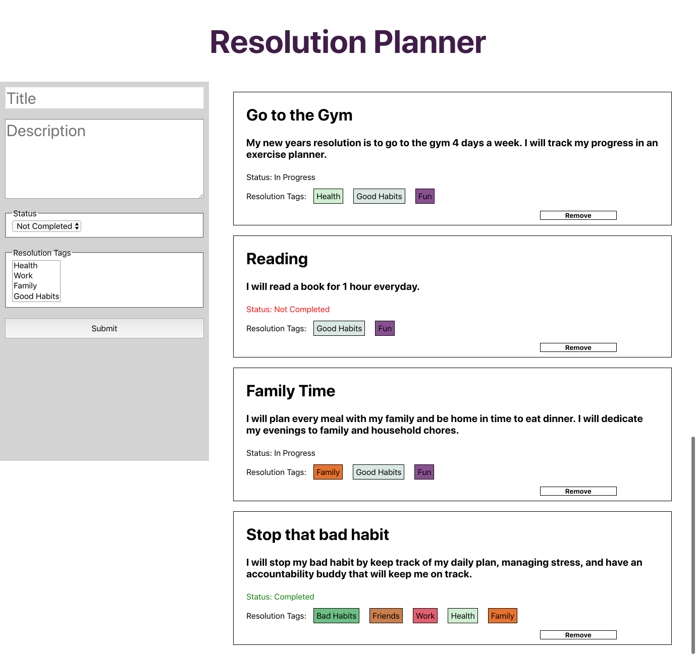

# Daily Practice

A repository to keep my code for various small, coding challenges.

### Tech Stack

* React
* Vanilla Javascript
* jQuery
* CSS
* HTML
* Testing: Mocha, Chai, Jest

## Code Challenges

### Linked List

Write a Linked List with OOP in Javascript using TDD.
- [X] Push
- [X] Pop
- [X] Delete
- [X] Includes
- [X] to Array
- [X] Index
- [X] Insert
- [ ] InsertAfter
- [ ] Distance

### Stoplight React

- [X] Build a stoplight in React. 

    * iteration 1: Upon refreshing the app, the stoplight starts as red, changes, to yellow and then to green.
    * iteration 2: the light continually changes at the interval specified

### Binary Search Tree
- [X] Write a Binary Search tree with OOP in Javascript using TDD.
   - [X] Insert
   - [X] Min
   - [X] Max
   - [X] Find
   - [X] Delete
   
### Tip Calculator React
- [X] Build a tip calculator in React
   
### Resolutions

Write a React App to track New Years Resolutions
Should be able to:

- [X] Add new - title, description, status, tags
- [X] Edit resolutions
- [X] Delete resolutions
- [X] View resolutions
- [ ] Search/filter by Title, description, status, tags

### jQuery Carousel

- [ ] Create an image carousel using jQuery. Instructions in Readme.

### Stoplight Vanilla JS

- [ ] Build a stoplight in Vanilla JS. Upon refreshing the app, the stoplight starts as red, changes, to yellow and then to green.

### So Many Activities

- [ ] Make a React App to track fun events. Instructions in Readme's

### Tip Calculator Vanilla JS

- [ ] Build a tip calculator in Vanilla JS

## Future Code Challenge Ideas
* Build Minesweeper
* Make a Ransom Note generator
* Make a Braille translator
* Build a Magic 8 Ball
* Rock Paper Scissors against computer
* [Ideas...](https://jenniferdewalt.com/)

